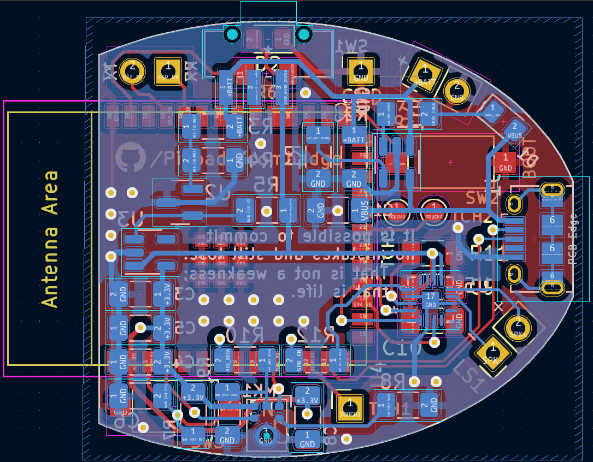

# Component Choices

The combadge is built around an [ESP32-S3-WROOM-1](https://www.espressif.com/en/support/download/documents/modules?keys=&field_type_tid%5B%5D=838).

I chose it because:

- It has hardware I2S and touch support
- It is well-supported by the Arduino toolchain
- It is cheaply available in my region

## Sound

I've chosen to adopt I2S peripherals for this project, as they promise better audio quality than their analog counterparts, while reducing the amount of analog circuitry I have to design.
The [ESP32](https://docs.espressif.com/projects/esp-idf/en/v4.2.3/esp32/api-reference/peripherals/i2s.html) supports two I2S peripherals in hardware.

### Microphone

I've zeroed in on the [CMM-3526D-261-I2S-TR](https://www.cuidevices.com/product/audio/microphones/mems-microphones/cmm-3526d-261-i2s-tr).
I suppose any similar microphone will do the job.

For testing, I'm using the INMP441, because it's available as a module. I would have stuck with it for the PCB, but it seems to be discontinued by the manufacturer.

### Speaker

With a speaker must come an amplifier. I chose the [MAX98357AETE+T](https://www.analog.com/en/products/max98357a.html#product-overview) because it's a class D amplifier that takes I2S input, and can drive a speaker with pretty much no external circuitry.
It's also what I used to prototype.

The [Taoglas SPKM.10.8.A](https://www.taoglas.com/product/10-mm-round-miniature-speaker-500mw/) seems like an adequate speaker for the job.

## Power Management

The unit runs on a lithium-polymer battery. Exact model and size undecided as of now. It will be one of the usual 3.7V LiPo cells.

All the chosen components of the combadge operate on 3.3V. I was hoping to find an all-in-one charging and voltage-regulating IC, but my searches yielded none for these parameters.
For charging, I plan to use an [MCP73831](https://www.microchip.com/en-us/product/MCP73831).
I found the 300mA [TLV74333PDBVR](https://www.ti.com/product/TLV743P/part-details/TLV74333PDBVR) LDO linear regulator for 3.3V power.
A [TLV431AQFTA](https://www.diodes.com/assets/Datasheets/TLV431Q.pdf)-based circuit conditionally disables the regulator for over-discharge protection.

I'm hoping decoupling capacitors will take care of any current spikes the ESP32 and speakers may need.
When I was prototyping, I was powering everything off my computer's USB port. The INMP441 microphone module worked well, but the MAX98357 with no power supply filtering was horribly noisy.
Some beefy electrolytic capacitors reduced the noise, but I feel I'll need ceramic capacitors with fast transient response times to completely eliminate it.

# PCB

The PCB has been designed in KiCAD.

- Footprints are chosen to be as large as possible where applicable, to facilitate hand-soldering.
- The PCB has headers to which battery and speaker wires can be soldered.
- Certain measurements can be seen in the `User.Comments` layer.

To load this KiCAD project, you will need to get the following third-party symbols and footprints:

- [CSS-1210TB](https://app.ultralibrarian.com/details/711a64f8-0773-11ed-b159-0a34d6323d74/Nidec-Copal-Electronics/CSS-1210TB?uid=38990419&exports=KiCAD&open=exports)
- [CMM-3526D-261-I2S-TR](https://www.cuidevices.com/product/resource/pcbfootprint/cmm-3526d-261-i2s-tr)
- [ESP32](https://github.com/espressif/kicad-libraries)

You will need to change the paths to the third party symbols in the library and footprint managers. I've just plonked everything in a gitignored folder called `third-party`.
