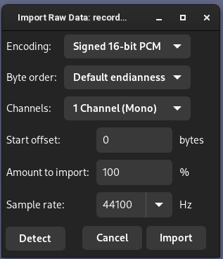

# inmp441TCPStream

A test program which streams recording microphone data points over TCP for a Python program to persist to file

## Usage

1. Modify `inmp441TCPStream.ino` to set constants like pins and WiFi credentials commensurate with your setup.
2. Open port 1592 on your firewall, and run `tcpRecorder.py`.
3. Upload the sketch to your ESP32.
4. Terminate the Python program with Ctrl-C.
5. Launch Audacity, and use `File -> Import -> Raw Data` to import your data as 44100Hz signed 16-bit little-endian (should be default).

