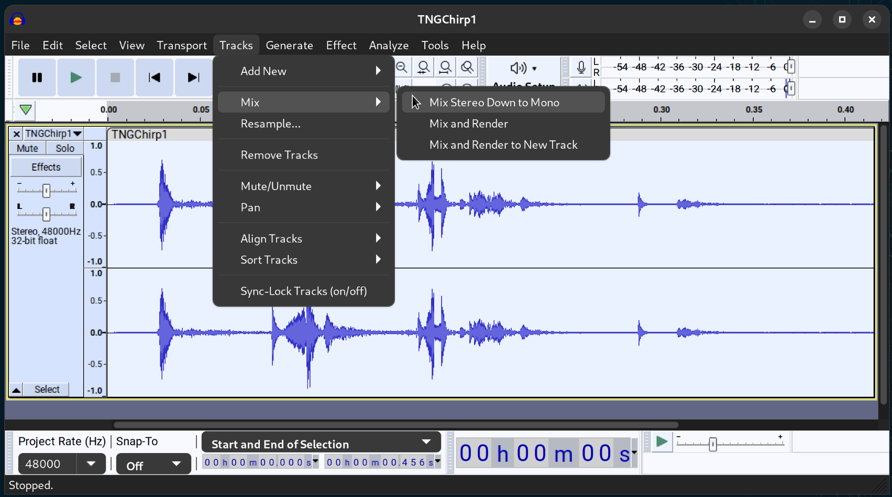
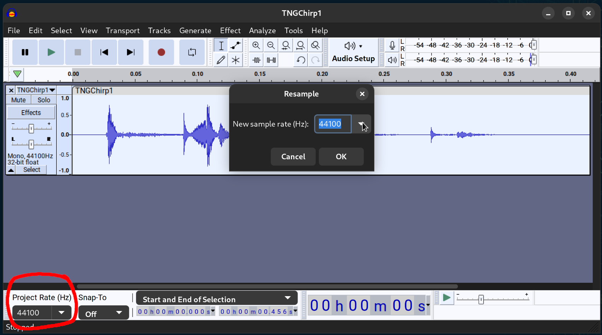
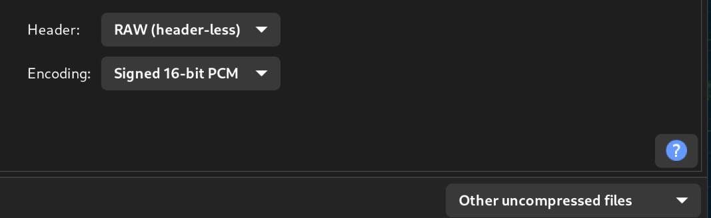

# Converting sound clips

In this project, sound clips generally reside as header files with large arrays of data points.

To generate such a file, first use a tool like [Audacity](https://www.audacityteam.org) to reformat your sound files to raw points.
Open the file you want to convert, and crop if needed. If it is a stereo track, select the track and mix the stereo channels to mono.



Next, check the sample rate in use in your [`config.h`](/software/combadge/config.h) in the `SAMPLE_RATE` definition.
If your track is not already using that sample rate, select the track and select `Tracks -> Resample...` to set the correct rate.
Set the project rate to the same rate as well.



Export the file with Shift-Ctrl-E. Set file type to "Other uncompressed files", header to "RAW (header-less)", and encoding to the type corresponding to the data type that `sample_t` is defined to in [`config.h`](/software/combadge/config.h).



Finally, invoke `headerFromRaw.py` to generate the header file accordingly.

```
~/path/to/sounds:$ python3 /path/to/headerFromRaw.py rawAudio.raw NameOfClip # Dry run
...
~/path/to/sounds:$ python3 /path/to/headerFromRaw.py rawAudio.raw NameOfClip > NameOfClip.h # Write to file
```

Move the generated header file to the appropriate location and use.
